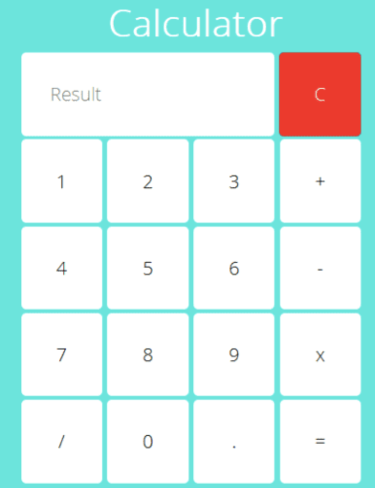

#  Day 03 - Frontend boot camp

## Contents

1. [Chapter I](#chapter-i) 
2. [Задание 1.](#задание-1) \
   2.1 [Обработка событий](#обработка-событий) 
3. [Задание 2.](#задание-2)
4. [Задание 3.](#задание-3)


## Chapter I
Адаптивная вёрстка меняет дизайн страницы в зависимости от поведения пользователя, платформы, размера экрана и ориентации девайса и является неотъемлемой частью современной веб-разработки. Она позволяет существенно экономить и не отрисовывать новый дизайн для каждого разрешения, а менять размеры и расположение отдельных элементов.


## Задание 1.
Задача - сверстать калькулятор, используя модуль CSS Grid Layout. Пример калькулятора: \

   <br>


### Обработка событий 

Событие — это сигнал от браузера о том, что что-то произошло (например: щелчок мыши, нажатие клавиши на клавиатуре и др.). Все DOM-узлы подают такие сигналы (хотя события бывают и не только в DOM).
Событию можно назначить обработчик, то есть функцию, которая сработает, как только событие произошло.
Именно благодаря обработчикам JavaScript код может реагировать на действия пользователя.

Есть несколько способов назначить событию обработчик: \
`-` Использовать HTML-аттрибут.
```
<script>
  function sayThankYou() {
     alert('Спасибо');
  }
</script>

<input type="button" onclick="sayThankYou()" value="Сказать спасибо">
```

`-` Использовать свойства DOM-объекта
```
<input id="elem" type="button" value="Нажми меня!">
<script>
  const elem = document.querySelector('#elem')
  elem.onclick = function() {
    alert('Спасибо');
  };
</script>
```
## Задание 2.
Реализация функционала работы калькулятора. Написать скрипт, который реализует все представленные в макете операции (сложение/вычитание/умножение/деление/стереть все)


## Задание 3.
Задача - улучшить свою страничку калькулятора
Добавить header на странице, где будет 2 ссылки: \
`-` На страницу calculator, где будет твой калькулятор. \
`-` На страницу Student Info. \
На странице Student info должны отображаться твое Фото и информация о тебе: \
`-` ФИО. \
`-` Стаж обучения. \
`-` Возраст.

